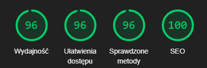

## Przegląd Projektu 🎨

  KubalekDev to nowoczesne portfolio prezentujące moje umiejętności jako Frontend Developera. Zbudowane z użyciem Next.js, Tailwind CSS, Shadcn/ui i TypeScript, projekt łączy estetykę, wydajność i responsywność, zapewniając wyjątkowe doświadczenia użytkownika.

## Technologia

## Wydajność

## Instalacja

## Licencja

## Na Żywo
